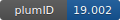

**Project ID:** [plumID:19.002]({{ '/' | absolute_url }}eggs/19/002/)  
**Name:**  EMMI STRA6  
**Archive:** [ https://github.com/maxbonomi/plumed-nest-data/raw/master/projects-2018/EMMI-STRA6.zip](https://github.com/maxbonomi/plumed-nest-data/raw/master/projects-2018/EMMI-STRA6.zip)  
**Category:**  bio  
**Keywords:**  metainference, cryo-EM  
**PLUMED version:**  2.6-dev  
**Contributor:**  Max Bonomi  
**Submitted on:** 11 Apr 2019  
**Last revised:** 06 May 2019  
**Publication:** [M. Bonomi, R. Pellarin, M. Vendruscolo, Simultaneous Determination of Protein Structure and Dynamics Using Cryo-Electron Microscopy. Biophysical Journal. 114, 1604–1613 (2018)](http://dx.doi.org/10.1016/j.bpj.2018.02.028)  
  
**PLUMED input files**  
  
| File     | Compatible with |  
|:--------:|:--------:|  
| [EMMI-STRA6/PRODUCTION/plumed.dat](./data/EMMI-STRA6/PRODUCTION/plumed.dat.md) |    |  
  
**Last tested:**  19 Feb 2025, 14:54:20
  
**Project description and instructions**  
Metainference is used to model a conformational ensemble of the STRA6 membrane receptor  using a 3.9-Ang-resolution [cryo-EM density map](http://dx.doi.org/10.1126/science.aad8266). The archive contains the GROMACS input files (SETUP directory, GROMACS v. 4.5.7), along with the PLUMED input files (PRODUCTION directory). These files have been updated to work with PLUMED version > 2.5. 

  
**Submission history**  
**[v1]** 11 Apr 2019: original submission  
**[v2]** 06 May 2019: updated description  
  
**Badge**  
Click on the image below and get the code to add the badge to your website!  

  

    &times;
    Markdown<pre></pre>
    HTML<pre>&lt;a href="https://www.plumed-nest.org/eggs/19/002/"&gt;&lt;img src="https://www.plumed-nest.org/eggs/19/002/badge.svg" alt="plumID:19.002"&gt;&lt;/a&gt;</pre>
  

