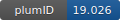

**Project ID:** [plumID:19.026]({{ '/' | absolute_url }}eggs/19/026/)  
**Name:**  Ice Nucleation on Cholesterol Crystals  
**Archive:** [ https://github.com/maxbonomi/plumed-nest-data/raw/master/projects-2019/FFS_ICE_CHL.zip](https://github.com/maxbonomi/plumed-nest-data/raw/master/projects-2019/FFS_ICE_CHL.zip)  
**Category:**  materials  
**Keywords:**  forward flux sampling, crystal nucleation, water, ice, organic crystals  
**PLUMED version:**  2.3.0-mod  
**Contributor:**  Gabriele Cesare Sosso  
**Submitted on:** 03 May 2019  
**Last revised:** 19 Jun 2019  
**Publication:** [G. C. Sosso, T. F. Whale, M. A. Holden, P. Pedevilla, B. J. Murray, A. Michaelides, Unravelling the origins of ice nucleation on organic crystals. Chemical Science. 9, 8077–8088 (2018)](http://dx.doi.org/10.1039/c8sc02753f)  
  
**PLUMED input files**  
  
| File     | Compatible with |  
|:--------:|:--------:|  
| [EXAMPLE/plumed.dat](./data/EXAMPLE/plumed.dat.md) |     |  
  
**Last tested:**  19 Feb 2025, 14:52:21
  
**Project description and instructions**  
This contribution refers to the following paper ["Unravelling the origins of ice nucleation on organic crystals"](https://pubs.rsc.org/en/content/articlelanding/2018/sc/c8sc02753f#!divAbstract) by Gabriele C. Sosso, Thomas F. Whale, Mark A. Holden, Philipp Pedevilla, Benjamin J. Murray and Angelos Michaelides, published in Chemical Science, Vol. 9, Pag. 8077-8088 (2018). A working (he said confidently...) example of a single FFS shoot can be found in EXAMPLE. This includes the plumed.dat file. The PLUMED version needed is a custom one, and can be found in PLUMED_FFS_CHL.

  
**Submission history**  
**[v1]** 03 May 2019: original submission  
**[v2]** 17 Jun 2019: Added additional cpp files  
**[v3]** 19 Jun 2019: revert to old zip with custom PLUMED  
  
**Badge**  
Click on the image below and get the code to add the badge to your website!  

  

    &times;
    Markdown<pre></pre>
    HTML<pre>&lt;a href="https://www.plumed-nest.org/eggs/19/026/"&gt;&lt;img src="https://www.plumed-nest.org/eggs/19/026/badge.svg" alt="plumID:19.026"&gt;&lt;/a&gt;</pre>
  

