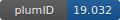

**Project ID:** [plumID:19.032]({{ '/' | absolute_url }}eggs/19/032/)  
**Name:**  Chemical reaction in solution using path collective variables based on coordination patterns  
**Archive:** [ https://github.com/physix-repo/plumed_input_pathcoordtable/raw/main/example-plumed2-pathcoordtable.zip](https://github.com/physix-repo/plumed_input_pathcoordtable/raw/main/example-plumed2-pathcoordtable.zip)  
**Category:**  chemistry  
**Keywords:**  chemical reactions, solutions, metadynamics, coordination patterns  
**PLUMED version:**  2.4  
**Contributor:**  Fabio Pietrucci  
**Submitted on:** 06 May 2019  
**Publication:** [F. Pietrucci, A. M. Saitta, Formamide reaction network in gas phase and solution via a unified theoretical approach: Toward a reconciliation of different prebiotic scenarios. Proceedings of the National Academy of Sciences. 112, 15030–15035 (2015)](http://dx.doi.org/10.1073/pnas.1512486112)  
  
**PLUMED input files**  
  
| File     | Compatible with |  
|:--------:|:--------:|  
| [plumed.dat](./data/plumed.dat.md) |    |  
  
**Last tested:**  19 Feb 2025, 14:42:45
  
**Project description and instructions**  
The input file plumed.dat defines a path collective variable based on distances between coordination patterns (tables of coordination numbers). In file path.pdb only two reference patterns, for the reactant and product state, are required, but more can be used if further information on the pathway is available. In this specific case the reaction goes from formamide to CO+NH3 in explicit water, and can be simulated, e.g., using quantum espresso or cp2k. A simple tool is also provided to simplify the creation of the path.pdb file. 

  
**Submission history**  
**[v1]** 06 May 2019: original submission  
  
**Badge**  
Click on the image below and get the code to add the badge to your website!  

  

    &times;
    Markdown<pre></pre>
    HTML<pre>&lt;a href="https://www.plumed-nest.org/eggs/19/032/"&gt;&lt;img src="https://www.plumed-nest.org/eggs/19/032/badge.svg" alt="plumID:19.032"&gt;&lt;/a&gt;</pre>
  

