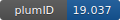

**Project ID:** [plumID:19.037]({{ '/' | absolute_url }}eggs/19/037/)  
**Name:**  Scission free energy of organic dyes  
**Archive:** [ https://github.com/praiteri/plumed_nest_dyes/archive/master.zip](https://github.com/praiteri/plumed_nest_dyes/archive/master.zip) [(browse)](https://github.com/praiteri/plumed_nest_dyes/tree/master)  
**Category:**  chemistry  
**Keywords:**  metadynamics, multiple walkers, matheval/lepton  
**PLUMED version:**  2.3  
**Contributor:**  Paolo Raiteri  
**Submitted on:** 07 May 2019  
**Publication:** [R. Drori, C. Li, C. Hu, P. Raiteri, A. L. Rohl, M. D. Ward, B. Kahr, A Supramolecular Ice Growth Inhibitor. Journal of the American Chemical Society. 138, 13396–13401 (2016)](http://dx.doi.org/10.1021/jacs.6b08267)  
  
**PLUMED input files**  
  
| File     | Compatible with |  
|:--------:|:--------:|  
| [Walker_0/plumed.mtd.inp](./data/Walker_0/plumed.mtd.inp.md) |    |  
| [Walker_1/plumed.mtd.inp](./data/Walker_1/plumed.mtd.inp.md) |    |  
  
**Last tested:**  19 Feb 2025, 14:47:04
  
**Project description and instructions**  
The simulations were run with LAMMPS. plumed.mtd.inp contains the definition of the CVs and the set up for the multiple walkers calculation.  prepare_plumed.sh is a simple script that can be used to create the directory structure for the multiple walkers calculation. Sample output files to test the CVs are also provided. More info can be found [here](https://pubs.acs.org/doi/10.1021/cg500752x). 

  
**Submission history**  
**[v1]** 07 May 2019: original submission  
  
**Badge**  
Click on the image below and get the code to add the badge to your website!  

  

    &times;
    Markdown<pre></pre>
    HTML<pre>&lt;a href="https://www.plumed-nest.org/eggs/19/037/"&gt;&lt;img src="https://www.plumed-nest.org/eggs/19/037/badge.svg" alt="plumID:19.037"&gt;&lt;/a&gt;</pre>
  

