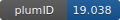

**Project ID:** [plumID:19.038]({{ '/' | absolute_url }}eggs/19/038/)  
**Name:**  native state dynamics of human and mouse b2m  
**Archive:** [ https://github.com/carlocamilloni/papers-data/raw/master/zip-for-nest/2019/achour2019_mb2m.zip](https://github.com/carlocamilloni/papers-data/raw/master/zip-for-nest/2019/achour2019_mb2m.zip)  
**Category:**  bio  
**Keywords:**  metainference, NMR, chemical shifts, metadynamics, protein dynamics, aggregation  
**PLUMED version:**  2.4  
**Contributor:**  Carlo Camilloni  
**Submitted on:** 07 May 2019  
**Publication:** [A. Achour, L. Broggini, X. Han, R. Sun, C. Santambrogio, J. Buratto, C. Visentin, A. Barbiroli, C. M. G. De Luca, P. Sormanni, F. Moda, A. De Simone, T. Sandalova, R. Grandori, C. Camilloni, S. Ricagno, Biochemical and biophysical comparison of human and mouse beta‐2 microglobulin reveals the molecular determinants of low amyloid propensity. The FEBS Journal. 287, 546–560 (2019)](http://dx.doi.org/10.1111/febs.15046)  
  
**PLUMED input files**  
  
| File     | Compatible with |  
|:--------:|:--------:|  
| [achour2019_mb2m/hb2m/plumed.dat](./data/achour2019_mb2m/hb2m/plumed.dat.md) |    |  
| [achour2019_mb2m/mb2m/plumed.dat](./data/achour2019_mb2m/mb2m/plumed.dat.md) |    |  
  
**Last tested:**  19 Feb 2025, 14:42:47
  
**Project description and instructions**  
this is a metadynamic metainference calculation using chemical shifts to infere and compare the native state dynamics of the human and mouse b2-microglobulin. This is performed using multi replicas (at least 8) and gromacs 2016.x or newer 

  
**Submission history**  
**[v1]** 07 May 2019: original submission  
  
**Badge**  
Click on the image below and get the code to add the badge to your website!  

  

    &times;
    Markdown<pre></pre>
    HTML<pre>&lt;a href="https://www.plumed-nest.org/eggs/19/038/"&gt;&lt;img src="https://www.plumed-nest.org/eggs/19/038/badge.svg" alt="plumID:19.038"&gt;&lt;/a&gt;</pre>
  

