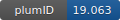

**Project ID:** [plumID:19.063]({{ '/' | absolute_url }}eggs/19/063/)  
**Name:**  Protein-ligand binding through metadynamics with path CVs  
**Archive:** [ https://github.com/mbernett/zip_for_nest/raw/master/b2-AR_path.zip](https://github.com/mbernett/zip_for_nest/raw/master/b2-AR_path.zip)  
**Category:**  bio  
**Keywords:**  metadynamics, path CVs, ligand binding  
**PLUMED version:**  2.1  
**Contributor:**  Mattia Bernetti  
**Submitted on:** 17 Aug 2019  
**Last revised:** 29 Aug 2019  
**Publication:** [M. Bernetti, M. Masetti, M. Recanatini, R. E. Amaro, A. Cavalli, An Integrated Markov State Model and Path Metadynamics Approach To Characterize Drug Binding Processes. Journal of Chemical Theory and Computation. 15, 5689–5702 (2019)](http://dx.doi.org/10.1021/acs.jctc.9b00450)  
  
**PLUMED input files**  
  
| File     | Compatible with |  
|:--------:|:--------:|  
| [plumed_path.dat](./data/plumed_path.dat.md) |    |  
  
**Last tested:**  19 Feb 2025, 14:49:59
  
**Project description and instructions**  
Input file to carry out a well-tempered metadynamics simulation of the alprenolol-b2AR binding process using path CVs. The zip includes a structure file gro.gro file to use as initial configuration to launch the simulations, the corresponding topology file top.top, the plumed input file plumed_path.dat necessary to perform metadynamics with path CVs, and the GROMACS (version 4.6.7) parameter file prod.mdp where the simulations parameters are specified. The frameset.pdb file is the guess path necessary to use the path CVs.

  
**Submission history**  
**[v1]** 17 Aug 2019: original submission  
**[v2]** 29 Aug 2019: updated doi  
  
**Badge**  
Click on the image below and get the code to add the badge to your website!  

  

    &times;
    Markdown<pre></pre>
    HTML<pre>&lt;a href="https://www.plumed-nest.org/eggs/19/063/"&gt;&lt;img src="https://www.plumed-nest.org/eggs/19/063/badge.svg" alt="plumID:19.063"&gt;&lt;/a&gt;</pre>
  

