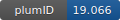

**Project ID:** [plumID:19.066]({{ '/' | absolute_url }}eggs/19/066/)  
**Name:**  Finding ligand unbinding reaction pathways  
**Archive:** [ https://github.com/jakryd/plumed-eggs/raw/master/2019_JCP/2019_JCP.zip](https://github.com/jakryd/plumed-eggs/raw/master/2019_JCP/2019_JCP.zip)  
**Category:**  methods  
**Keywords:**  maze, ligand unbinding  
**PLUMED version:**  2.6-dev  
**Contributor:**  Jakub Rydzewski  
**Submitted on:** 09 Sep 2019  
**Publication:** [J. Rydzewski, O. Valsson, Finding multiple reaction pathways of ligand unbinding. The Journal of Chemical Physics. 150 (2019)](http://dx.doi.org/10.1063/1.5108638)  
  
**PLUMED input files**  
  
| File     | Compatible with |  
|:--------:|:--------:|  
| [4w52/plumed.dat](./data/4w52/plumed.dat.md) |    |  
  
**Last tested:**  19 Feb 2025, 14:49:35
  
**Project description and instructions**  
The folder in 2019_JCP is labeled by the system PDB ID.

  
**Submission history**  
**[v1]** 09 Sep 2019: original submission  
  
**Badge**  
Click on the image below and get the code to add the badge to your website!  

  

    &times;
    Markdown<pre></pre>
    HTML<pre>&lt;a href="https://www.plumed-nest.org/eggs/19/066/"&gt;&lt;img src="https://www.plumed-nest.org/eggs/19/066/badge.svg" alt="plumID:19.066"&gt;&lt;/a&gt;</pre>
  

