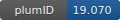

**Project ID:** [plumID:19.070]({{ '/' | absolute_url }}eggs/19/070/)  
**Name:**  Unexpected Dynamics in the UUCG RNA Tetraloop  
**Archive:** [ https://github.com/sbottaro/UUCG_UNEXPECTED/raw/master/plumed_nest_uucg.zip](https://github.com/sbottaro/UUCG_UNEXPECTED/raw/master/plumed_nest_uucg.zip)  
**Category:**  bio  
**Keywords:**  well-tempered metadynamics, RNA, UUCG, maximum entropy  
**PLUMED version:**  2.5  
**Contributor:**  Sandro Bottaro  
**Submitted on:** 23 Sep 2019  
**Last revised:** 17 Jun 2020  
**Publication:** [S. Bottaro, P. J. Nichols, B. Vögeli, M. Parrinello, K. Lindorff-Larsen, Integrating NMR and simulations reveals motions in the UUCG tetraloop. Nucleic Acids Research. 48, 5839–5848 (2020)](http://dx.doi.org/10.1093/nar/gkaa399)  
  
**PLUMED input files**  
  
| File     | Compatible with |  
|:--------:|:--------:|  
| [plumed_nest_uucg/plumed.dat](./data/plumed_nest_uucg/plumed.dat.md) |    |  
  
**Last tested:**  19 Feb 2025, 14:49:27
  
**Project description and instructions**  
Simulations have been carried out with GROMACS 2016.4 and PLUMED 2.5.0. More information [here](https://www.biorxiv.org/content/10.1101/690412v2). 

  
**Submission history**  
**[v1]** 23 Sep 2019: original submission  
**[v2]** 17 Jun 2020: updated doi  
  
**Badge**  
Click on the image below and get the code to add the badge to your website!  

  

    &times;
    Markdown<pre></pre>
    HTML<pre>&lt;a href="https://www.plumed-nest.org/eggs/19/070/"&gt;&lt;img src="https://www.plumed-nest.org/eggs/19/070/badge.svg" alt="plumID:19.070"&gt;&lt;/a&gt;</pre>
  

