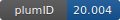

**Project ID:** [plumID:20.004]({{ '/' | absolute_url }}eggs/20/004/)  
**Name:**  Data-driven collective variables for enhanced sampling  
**Archive:** [ https://github.com/luigibonati/data-driven-CVs/archive/master.zip](https://github.com/luigibonati/data-driven-CVs/archive/master.zip) [(browse)](https://github.com/luigibonati/data-driven-CVs/tree/master)  
**Category:**  methods  
**Keywords:**  collective variables, machine learning, deep-lda  
**PLUMED version:**  2.5-dev  
**Contributor:**  Luigi Bonati  
**Submitted on:** 18 Feb 2020  
**Last revised:** 06 Apr 2020  
**Publication:** [L. Bonati, V. Rizzi, M. Parrinello, Data-Driven Collective Variables for Enhanced Sampling. The Journal of Physical Chemistry Letters. 11, 2998–3004 (2020)](http://dx.doi.org/10.1021/acs.jpclett.0c00535)  
  
**PLUMED input files**  
  
| File     | Compatible with |  
|:--------:|:--------:|  
| [ala2/3_enhanced_sampling/plumed.dat](./data/ala2/3_enhanced_sampling/plumed.dat.md) |    |  
| [aldol/3_enhanced_sampling/plumed.dat](./data/aldol/3_enhanced_sampling/plumed.dat.md) |     |  
  
**Last tested:**  19 Feb 2025, 14:40:35
  
**Project description and instructions**  
This egg contains the Pytorch interface and input files necessary to use a Deep-LDA collective variable, as well as additional code to reproduce the result reported in the paper. The Deep-LDA CV is constructed by optimizing a neural network using Fisher's linear discriminant as the objective function to maximize the separation between the states.  Note that the build fails because PLUMED needs to be manually compiled with LibTorch. We have released a Google Colab Notebook, available [here](https://colab.research.google.com/drive/1dG0ohT75R-UZAFMf_cbYPNQwBaOsVaAA) with a tutorial about the Deep-LDA CV training and the PLUMED configuration needed to use it. The code has been tested with the latest version of Pytorch (1.4).

  
**Submission history**  
**[v1]** 18 Feb 2020: original submission  
**[v2]** 06 Apr 2020: updated doi and instructions  
  
**Badge**  
Click on the image below and get the code to add the badge to your website!  

  

    &times;
    Markdown<pre></pre>
    HTML<pre>&lt;a href="https://www.plumed-nest.org/eggs/20/004/"&gt;&lt;img src="https://www.plumed-nest.org/eggs/20/004/badge.svg" alt="plumID:20.004"&gt;&lt;/a&gt;</pre>
  

