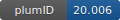

**Project ID:** [plumID:20.006]({{ '/' | absolute_url }}eggs/20/006/)  
**Name:**  Class B GPCR activation mechanism  
**Archive:** [ https://github.com/Gervasiolab/Gervasio-Protein-Dynamics/raw/master/GCGR-metad/NEST.zip](https://github.com/Gervasiolab/Gervasio-Protein-Dynamics/raw/master/GCGR-metad/NEST.zip)  
**Category:**  bio  
**Keywords:**  metadynamics, well-tempered ensemble, multiple walkers, Parallel-tempering metadynamics, GPCRs, ligand binding  
**PLUMED version:**  2.4.3  
**Contributor:**  Francesco Gervasio  
**Submitted on:** 07 Apr 2020  
**Last revised:** 27 Jun 2020  
**Publication:** [G. Mattedi, S. Acosta-Gutiérrez, T. Clark, F. L. Gervasio, A combined activation mechanism for the glucagon receptor. Proceedings of the National Academy of Sciences. 117, 15414–15422 (2020)](http://dx.doi.org/10.1073/pnas.1921851117)  
  
**PLUMED input files**  
  
| File     | Compatible with |  
|:--------:|:--------:|  
| [metad_GCGR/plumed.dat](./data/metad_GCGR/plumed.dat.md) |    |  
| [metad_GCGR-GPR/plumed.dat](./data/metad_GCGR-GPR/plumed.dat.md) |    |  
  
**Last tested:**  19 Feb 2025, 14:42:35
  
**Project description and instructions**  
These are the input files used to fully converge the free energy landscapes of the glucagon receptor activation with and without G-protein. The input files were used with GROMACS 2016.3 and PLUMED 2.4.3 using the AMBER14SB force field, phospholipid topologies from LipidBook.

  
**Submission history**  
**[v1]** 07 Apr 2020: original submission  
**[v2]** 27 Jun 2020: updated doi  
  
**Badge**  
Click on the image below and get the code to add the badge to your website!  

  

    &times;
    Markdown<pre></pre>
    HTML<pre>&lt;a href="https://www.plumed-nest.org/eggs/20/006/"&gt;&lt;img src="https://www.plumed-nest.org/eggs/20/006/badge.svg" alt="plumID:20.006"&gt;&lt;/a&gt;</pre>
  

