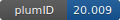

**Project ID:** [plumID:20.009]({{ '/' | absolute_url }}eggs/20/009/)  
**Name:**  The dynamics of linear polyubiquitin  
**Archive:** [ https://zenodo.org/record/3878218/files/polyubiquitin_files.zip](https://zenodo.org/record/3878218/files/polyubiquitin_files.zip)  
**Category:**  bio  
**Keywords:**  saxs, martini, metainference, metadynamics, ubiquitin, protein dynamics  
**PLUMED version:**  2.6  
**Contributor:**  Carlo Camilloni  
**Submitted on:** 14 Apr 2020  
**Last revised:** 15 Oct 2020  
**Publication:** [A. Jussupow, A. C. Messias, R. Stehle, A. Geerlof, S. M. Ø. Solbak, C. Paissoni, A. Bach, M. Sattler, C. Camilloni, The dynamics of linear polyubiquitin. Science Advances. 6 (2020)](http://dx.doi.org/10.1126/sciadv.abc3786)  
  
**PLUMED input files**  
  
| File     | Compatible with |  
|:--------:|:--------:|  
| [Ub2/plumed-cv.dat](./data/Ub2/plumed-cv.dat.md) |    |  
| [Ub3/plumed-cv.dat](./data/Ub3/plumed-cv.dat.md) |    |  
| [Ub4/plumed-cv.dat](./data/Ub4/plumed-cv.dat.md) |    |  
  
**Last tested:**  19 Feb 2025, 14:42:21
  
**Project description and instructions**  
this is a metadynamic metainference Martini calculation using SAXS.  Simulations are performed with gromacs 2016 or newer

  
**Submission history**  
**[v1]** 14 Apr 2020: original submission  
**[v2]** 15 Oct 2020: updated doi  
  
**Badge**  
Click on the image below and get the code to add the badge to your website!  

  

    &times;
    Markdown<pre></pre>
    HTML<pre>&lt;a href="https://www.plumed-nest.org/eggs/20/009/"&gt;&lt;img src="https://www.plumed-nest.org/eggs/20/009/badge.svg" alt="plumID:20.009"&gt;&lt;/a&gt;</pre>
  

