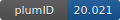

**Project ID:** [plumID:20.021]({{ '/' | absolute_url }}eggs/20/021/)  
**Name:**  Mapping the transition state for a binding reaction between ancient intrinsically disordered proteins.  
**Archive:** [ https://zenodo.org/record/3941575/files/PLUMED_NEST_AncestralTS.zip](https://zenodo.org/record/3941575/files/PLUMED_NEST_AncestralTS.zip)  
**Category:**  bio  
**Keywords:**  phi-values, restrained MD, transition-state, protein folding, disordered proteins, protein evolution  
**PLUMED version:**  2.6  
**Contributor:**  Cristina Paissoni  
**Submitted on:** 13 Jul 2020  
**Publication:** [E. Karlsson, C. Paissoni, A. M. Erkelens, Z. A. Tehranizadeh, F. A. Sorgenfrei, E. Andersson, W. Ye, C. Camilloni, P. Jemth, Mapping the transition state for a binding reaction between ancient intrinsically disordered proteins. Journal of Biological Chemistry. 295, 17698–17712 (2020)](http://dx.doi.org/10.1074/jbc.RA120.015645)  
  
**PLUMED input files**  
  
| File     | Compatible with |  
|:--------:|:--------:|  
| [plumed_K10.dat](./data/plumed_K10.dat.md) |    |  
| [plumed_K200.dat](./data/plumed_K200.dat.md) |    |  
| [plumed_K50.dat](./data/plumed_K50.dat.md) |    |  
  
**Last tested:**  19 Feb 2025, 14:34:49
  
**Project description and instructions**  
this is a restrained MD simulation using simulated annealing employed to model the transition state of a protein using phi-value data it can be run using gromacs 2018 or more recent

  
**Submission history**  
**[v1]** 13 Jul 2020: original submission  
  
**Badge**  
Click on the image below and get the code to add the badge to your website!  

  

    &times;
    Markdown<pre></pre>
    HTML<pre>&lt;a href="https://www.plumed-nest.org/eggs/20/021/"&gt;&lt;img src="https://www.plumed-nest.org/eggs/20/021/badge.svg" alt="plumID:20.021"&gt;&lt;/a&gt;</pre>
  

