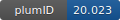

**Project ID:** [plumID:20.023]({{ '/' | absolute_url }}eggs/20/023/)  
**Name:**  metadynminer and metadynminer3d  
**Archive:** [ https://github.com/spiwokv/metadynminerdata/raw/master/all.zip](https://github.com/spiwokv/metadynminerdata/raw/master/all.zip)  
**Category:**  methods  
**Keywords:**  metadynamics, visualization, R  
**PLUMED version:**  2.4  
**Contributor:**  Vojtech Spiwok  
**Submitted on:** 21 Aug 2020  
**Last revised:** 18 Jan 2022  
**Publication:** [D. Trapl, V. Spiwok, Analysis of the Results of Metadynamics Simulations by metadynminer and metadynminer3d. The R Journal. 14, 46–58 (2022)](http://dx.doi.org/10.32614/RJ-2022-057)  
  
**PLUMED input files**  
  
| File     | Compatible with |  
|:--------:|:--------:|  
| [1D/plumed.dat](./data/1D/plumed.dat.md) |    |  
| [2D/plumed.dat](./data/2D/plumed.dat.md) |    |  
| [3D/plumed.dat](./data/3D/plumed.dat.md) |    |  
  
**Last tested:**  19 Feb 2025, 14:43:56
  
**Project description and instructions**  
Metadynminer and metadynminer3d are R packages for analysis and visualization of metadynamics results. It calculates and plots free energy surfaces, finds minima, evolution of relative free energy, nudged elastic band etc. Here we submit sample data (1D, 2D and 3D free energy surfaces of alanine dipeptide).

  
**Submission history**  
**[v1]** 21 Aug 2020: original submission  
**[v2]** 18 Jan 2022: updated doi  
  
**Badge**  
Click on the image below and get the code to add the badge to your website!  

  

    &times;
    Markdown<pre></pre>
    HTML<pre>&lt;a href="https://www.plumed-nest.org/eggs/20/023/"&gt;&lt;img src="https://www.plumed-nest.org/eggs/20/023/badge.svg" alt="plumID:20.023"&gt;&lt;/a&gt;</pre>
  

