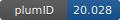

**Project ID:** [plumID:20.028]({{ '/' | absolute_url }}eggs/20/028/)  
**Name:**  Well-tempered metadynamics on wt/onc KRas-4B, binding on the anionic membrane  
**Archive:** [ https://github.com/HuixiaLu/well-tempered-metadynamics-on-wt.-onc.-KRas-4B-binding-on-the-anionic-membrane/archive/master.zip](https://github.com/HuixiaLu/well-tempered-metadynamics-on-wt.-onc.-KRas-4B-binding-on-the-anionic-membrane/archive/master.zip) [(browse)](https://github.com/HuixiaLu/well-tempered-metadynamics-on-wt.-onc.-KRas-4B-binding-on-the-anionic-membrane/tree/master)  
**Category:**  bio  
**Keywords:**  metadynamics, KRas-4B, anionic membrane  
**PLUMED version:**  2.5  
**Contributor:**  Huixia Lu  
**Submitted on:** 26 Oct 2020  
**Last revised:** 15 Jan 2021  
**Publication:** [H. Lu, J. Martí, Long-lasting Salt Bridges Provide the Anchoring Mechanism of Oncogenic Kirsten Rat Sarcoma Proteins at Cell Membranes. The Journal of Physical Chemistry Letters. 11, 9938–9945 (2020)](http://dx.doi.org/10.1021/acs.jpclett.0c02809)  
  
**PLUMED input files**  
  
| File     | Compatible with |  
|:--------:|:--------:|  
| [wild-type/plumed-1.dat](./data/wild-type/plumed-1.dat.md) |    |  
| [oncogenic/plumed-1.dat](./data/oncogenic/plumed-1.dat.md) |    |  
  
**Last tested:**  19 Feb 2025, 14:50:22
  
**Project description and instructions**  
Use command line 'gmx mdrun -deffnm 800ns-metadynamics -v -plumed plumed-1.dat' to start the metadynamics simulation 

  
**Submission history**  
**[v1]** 26 Oct 2020: original submission  
**[v2]** 15 Jan 2021: updated doi  
  
**Badge**  
Click on the image below and get the code to add the badge to your website!  

  

    &times;
    Markdown<pre></pre>
    HTML<pre>&lt;a href="https://www.plumed-nest.org/eggs/20/028/"&gt;&lt;img src="https://www.plumed-nest.org/eggs/20/028/badge.svg" alt="plumID:20.028"&gt;&lt;/a&gt;</pre>
  

