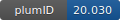

**Project ID:** [plumID:20.030]({{ '/' | absolute_url }}eggs/20/030/)  
**Name:**  Converging experimental and computational views of the knotting mechanism of the smallest knotted protein  
**Archive:** [ https://zenodo.org/record/4196336/files/PLUMED_NEST_MJ0366.zip](https://zenodo.org/record/4196336/files/PLUMED_NEST_MJ0366.zip)  
**Category:**  bio  
**Keywords:**  phi-values, transition state, knotted proteins  
**PLUMED version:**  2.6  
**Contributor:**  Cristina Paissoni  
**Submitted on:** 02 Nov 2020  
**Publication:** [C. Paissoni, S. Puri, I. Wang, S.-Y. Chen, C. Camilloni, S.-T. D. Hsu, Converging experimental and computational views of the knotting mechanism of a small knotted protein. Biophysical Journal. 120, 2276–2286 (2021)](http://dx.doi.org/10.1016/j.bpj.2021.03.032)  
  
**PLUMED input files**  
  
| File     | Compatible with |  
|:--------:|:--------:|  
| [plumed0.dat](./data/plumed0.dat.md) |    |  
| [plumed1.dat](./data/plumed1.dat.md) |    |  
| [plumed2.dat](./data/plumed2.dat.md) |    |  
  
**Last tested:**  19 Feb 2025, 14:34:45
  
**Project description and instructions**  
this is a phi-value restrained annealing MD simulations using GROMACS + PLUMED. The restraint strength is increased gradually. 

  
**Submission history**  
**[v1]** 02 Nov 2020: original submission  
  
**Badge**  
Click on the image below and get the code to add the badge to your website!  

  

    &times;
    Markdown<pre></pre>
    HTML<pre>&lt;a href="https://www.plumed-nest.org/eggs/20/030/"&gt;&lt;img src="https://www.plumed-nest.org/eggs/20/030/badge.svg" alt="plumID:20.030"&gt;&lt;/a&gt;</pre>
  

