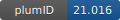

**Project ID:** [plumID:21.016]({{ '/' | absolute_url }}eggs/21/016/)  
**Name:**  MD SAXS GTPase associated center  
**Archive:** [ https://github.com/bussilab/saxs-md-gac/archive/24f5aa860bf1b3c6eb2062a5137999dba082561d.zip](https://github.com/bussilab/saxs-md-gac/archive/24f5aa860bf1b3c6eb2062a5137999dba082561d.zip) [(browse)](https://github.com/bussilab/saxs-md-gac/tree/24f5aa860bf1b3c6eb2062a5137999dba082561d)  
**Category:**  bio  
**Keywords:**  metadynamics, RNA, folding, SAXS  
**PLUMED version:**  2.5  
**Contributor:**  Giovanni Bussi  
**Submitted on:** 19 Apr 2021  
**Last revised:** 03 Apr 2022  
**Publication:** [M. Bernetti, K. B. Hall, G. Bussi, Reweighting of molecular simulations with explicit-solvent SAXS restraints elucidates ion-dependent RNA ensembles. Nucleic Acids Research. 49, e84–e84 (2021)](http://dx.doi.org/10.1093/nar/gkab459)  
  
**PLUMED input files**  
  
| File     | Compatible with |  
|:--------:|:--------:|  
| [input_files/plumed.dat](./data/input_files/plumed.dat.md) |    |  
  
**Last tested:**  19 Feb 2025, 14:30:02
  
**Project description and instructions**  
The included input file has been adapted to be compatible with v2.7. In particular, SAXS components are labeled as `saxs_bias.q-0` instead of `saxs_bias.q_0`.

  
**Submission history**  
**[v1]** 19 Apr 2021: original submission  
**[v2]** 14 Jun 2021: added DOI  
**[v3]** 03 Apr 2022: fixed input for plumed 2.8  
  
**Badge**  
Click on the image below and get the code to add the badge to your website!  

  

    &times;
    Markdown<pre></pre>
    HTML<pre>&lt;a href="https://www.plumed-nest.org/eggs/21/016/"&gt;&lt;img src="https://www.plumed-nest.org/eggs/21/016/badge.svg" alt="plumID:21.016"&gt;&lt;/a&gt;</pre>
  

