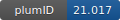

**Project ID:** [plumID:21.017]({{ '/' | absolute_url }}eggs/21/017/)  
**Name:**  All-atom simulations of the Vav1 AD construct  
**Archive:** [ https://zenodo.org/record/4733551/files/plumed.zip](https://zenodo.org/record/4733551/files/plumed.zip)  
**Category:**  bio  
**Keywords:**  metadynamics, parallel-bias, well-tempered  
**PLUMED version:**  2.5  
**Contributor:**  Simone Orioli  
**Submitted on:** 27 Apr 2021  
**Last revised:** 09 Dec 2021  
**Publication:** [S. Orioli, C. G. Henning Hansen, K. Lindorff-Larsen, Transient exposure of a buried phosphorylation site in an autoinhibited protein. Biophysical Journal. 121, 91–101 (2022)](http://dx.doi.org/10.1016/j.bpj.2021.11.2890)  
  
**PLUMED input files**  
  
| File     | Compatible with |  
|:--------:|:--------:|  
| [plumed/pbmetad/plumed.dat](./data/plumed/pbmetad/plumed.dat.md) |    |  
| [plumed/pbmetad/reweight.dat](./data/plumed/pbmetad/reweight.dat.md) |    |  
| [plumed/md/nmr_disp.dat](./data/plumed/md/nmr_disp.dat.md) |    |  
| [plumed/md/nmr_c36m.dat](./data/plumed/md/nmr_c36m.dat.md) |    |  
| [plumed/md/cry_disp.dat](./data/plumed/md/cry_disp.dat.md) |    |  
| [plumed/md/cry_c36m.dat](./data/plumed/md/cry_c36m.dat.md) |    |  
| [plumed/md/shootings.dat](./data/plumed/md/shootings.dat.md) |    |  
| [plumed/wtmetad/plumed.dat](./data/plumed/wtmetad/plumed.dat.md) |    |  
| [plumed/wtmetad/reweight.dat](./data/plumed/wtmetad/reweight.dat.md) |    |  
  
**Last tested:**  19 Feb 2025, 14:48:13
  
**Project description and instructions**  
The scripts are needed to reproduce and reweight the metadynamics simulations (WTMetaD and PBMetaD) and to calculate the CVs from the all-atom MD simulations. Simulations have been performed with Gromacs 2018.6 and Plumed 2.5.0

  
**Submission history**  
**[v1]** 27 Apr 2021: original submission  
**[v2]** 04 Aug 2021: updated doi  
**[v3]** 09 Dec 2021: updated doi  
  
**Badge**  
Click on the image below and get the code to add the badge to your website!  

  

    &times;
    Markdown<pre></pre>
    HTML<pre>&lt;a href="https://www.plumed-nest.org/eggs/21/017/"&gt;&lt;img src="https://www.plumed-nest.org/eggs/21/017/badge.svg" alt="plumID:21.017"&gt;&lt;/a&gt;</pre>
  

