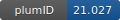

**Project ID:** [plumID:21.027]({{ '/' | absolute_url }}eggs/21/027/)  
**Name:**  EGFR activating mutations mechanism  
**Archive:** [ https://github.com/Gervasiolab/Gervasio-Protein-Dynamics/raw/master/EGFR-metaD/EGFR-metaD.zip](https://github.com/Gervasiolab/Gervasio-Protein-Dynamics/raw/master/EGFR-metaD/EGFR-metaD.zip)  
**Category:**  bio  
**Keywords:**  metadynamics, well-tempered ensemble, Parallel-tempering, EGFR, L858R, A763-Y764insFQEA, D770-N771insNPG, Delta-ELREA  
**PLUMED version:**  2.4  
**Contributor:**  Francesco Gervasio  
**Submitted on:** 28 Jun 2021  
**Last revised:** 04 Aug 2021  
**Publication:** [I. Galdadas, L. Carlino, R. A. Ward, S. J. Hughes, S. Haider, F. L. Gervasio, Structural basis of the effect of activating mutations on the EGF receptor. eLife. 10 (2021)](http://dx.doi.org/10.7554/eLife.65824)  
  
**PLUMED input files**  
  
| File     | Compatible with |  
|:--------:|:--------:|  
| [A763-Y764insFQEA/plumed.dat](./data/A763-Y764insFQEA/plumed.dat.md) |    |  
| [D770-N771insNPG/plumed.dat](./data/D770-N771insNPG/plumed.dat.md) |    |  
| [L858R/plumed.dat](./data/L858R/plumed.dat.md) |    |  
| [WT/plumed.dat](./data/WT/plumed.dat.md) |    |  
| [delE746-A750/plumed.dat](./data/delE746-A750/plumed.dat.md) |    |  
  
**Last tested:**  19 Feb 2025, 14:31:36
  
**Project description and instructions**  
The simulations were run with Gromacs 2018.3 simulation engine. 

  
**Submission history**  
**[v1]** 28 Jun 2021: original submission  
**[v2]** 04 Aug 2021: updated doi  
  
**Badge**  
Click on the image below and get the code to add the badge to your website!  

  

    &times;
    Markdown<pre></pre>
    HTML<pre>&lt;a href="https://www.plumed-nest.org/eggs/21/027/"&gt;&lt;img src="https://www.plumed-nest.org/eggs/21/027/badge.svg" alt="plumID:21.027"&gt;&lt;/a&gt;</pre>
  

