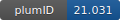

**Project ID:** [plumID:21.031]({{ '/' | absolute_url }}eggs/21/031/)  
**Name:**  Photo-switchable sulfonulureas in KATP channel  
**Archive:** [ https://github.com/kszewc/KATP/raw/04d5b47312b5d434e7476dc8ace91148ac38dfef/PHOTOSWITCHABLE_SULFONYLUREAS/PLUMED_METADYNAMICS_SIMULATIONS/APO.zip](https://github.com/kszewc/KATP/raw/04d5b47312b5d434e7476dc8ace91148ac38dfef/PHOTOSWITCHABLE_SULFONYLUREAS/PLUMED_METADYNAMICS_SIMULATIONS/APO.zip)  
**Category:**  bio  
**Keywords:**  metadynamics, photo-pharmacology, sulfonylureas potasium ion-channels  
**PLUMED version:**  2.6  
**Contributor:**  Katarzyna Walczewska-Szewc  
**Submitted on:** 13 Jul 2021  
**Last revised:** 09 Dec 2021  
**Publication:** [K. Walczewska-Szewc, W. Nowak, Photo-Switchable Sulfonylureas Binding to ATP-Sensitive Potassium Channel Reveal the Mechanism of Light-Controlled Insulin Release. The Journal of Physical Chemistry B. 125, 13111–13121 (2021)](http://dx.doi.org/10.1021/acs.jpcb.1c07292)  
  
**PLUMED input files**  
  
| File     | Compatible with |  
|:--------:|:--------:|  
| [plumed.dat](./data/plumed.dat.md) |    |  
  
**Last tested:**  19 Feb 2025, 14:46:09
  
**Project description and instructions**  
Each directory contain full set of GROMACS/PLUMED simulation input files together with an exemplary run script. 

  
**Submission history**  
**[v1]** 13 Jul 2021: original submission  
**[v2]** 09 Dec 2021: updated doi  
  
**Badge**  
Click on the image below and get the code to add the badge to your website!  

  

    &times;
    Markdown<pre></pre>
    HTML<pre>&lt;a href="https://www.plumed-nest.org/eggs/21/031/"&gt;&lt;img src="https://www.plumed-nest.org/eggs/21/031/badge.svg" alt="plumID:21.031"&gt;&lt;/a&gt;</pre>
  

