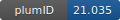

**Project ID:** [plumID:21.035]({{ '/' | absolute_url }}eggs/21/035/)  
**Name:**  CmuMD simulations of NaCl(aq) at NaCl  
**Archive:** [ https://github.com/aaronrfinney/plumed-nest/raw/main/CmuMD-NaCl.zip](https://github.com/aaronrfinney/plumed-nest/raw/main/CmuMD-NaCl.zip)  
**Category:**  chemistry  
**Keywords:**  CmuMD, interface  
**PLUMED version:**  2.5.1  
**Contributor:**  Aaron Finney  
**Submitted on:** 31 Aug 2021  
**Publication:** [A. R. Finney, M. Salvalaglio, Bridging the gap between mesoscopic and molecular models of solid/liquid interfaces out-of-equilibrium. Chemical Engineering Research and Design. 180, 285–295 (2022)](http://dx.doi.org/10.1016/j.cherd.2022.02.018)  
  
**PLUMED input files**  
  
| File     | Compatible with |  
|:--------:|:--------:|  
| [CmuMD-NaCl/flat-plumed.dat](./data/CmuMD-NaCl/flat-plumed.dat.md) |     |  
| [CmuMD-NaCl/rough-plumed.dat](./data/CmuMD-NaCl/rough-plumed.dat.md) |     |  
  
**Last tested:**  19 Feb 2025, 14:38:24
  
**Project description and instructions**  
Run using GROMACS (2018.6) according to e.g., gmx mdrun -deffnm cmumd -plumed flat-plumed.dat.

  
**Submission history**  
**[v1]** 31 Aug 2021: original submission  
  
**Badge**  
Click on the image below and get the code to add the badge to your website!  

  

    &times;
    Markdown<pre></pre>
    HTML<pre>&lt;a href="https://www.plumed-nest.org/eggs/21/035/"&gt;&lt;img src="https://www.plumed-nest.org/eggs/21/035/badge.svg" alt="plumID:21.035"&gt;&lt;/a&gt;</pre>
  

