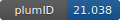

**Project ID:** [plumID:21.038]({{ '/' | absolute_url }}eggs/21/038/)  
**Name:**  Towards automated sampling of polymorph nucleation and free energies with SGOOP and metadynamics  
**Archive:** [ https://github.com/connorzzou/PLUMED-NEST/raw/main/UreaNucleationFromMelt.zip](https://github.com/connorzzou/PLUMED-NEST/raw/main/UreaNucleationFromMelt.zip)  
**Category:**  materials  
**Keywords:**  metadynamics, SGOOP, nucleation, urea  
**PLUMED version:**  2.6.1  
**Contributor:**  Ziyue Zou  
**Submitted on:** 16 Oct 2021  
**Last revised:** 09 Dec 2021  
**Publication:** [Z. Zou, S.-T. Tsai, P. Tiwary, Toward Automated Sampling of Polymorph Nucleation and Free Energies with the SGOOP and Metadynamics. The Journal of Physical Chemistry B. 125, 13049–13056 (2021)](http://dx.doi.org/10.1021/acs.jpcb.1c07595)  
  
**PLUMED input files**  
  
| File     | Compatible with |  
|:--------:|:--------:|  
| [UreaNucleationFromMelt/chi2.dat](./data/UreaNucleationFromMelt/chi2.dat.md) |     |  
| [UreaNucleationFromMelt/chi4.dat](./data/UreaNucleationFromMelt/chi4.dat.md) |     |  
| [UreaNucleationFromMelt/chi6.dat](./data/UreaNucleationFromMelt/chi6.dat.md) |     |  
  
**Last tested:**  19 Feb 2025, 14:43:50
  
**Project description and instructions**  
The simulations were performed with Gromacs-2020.2. 

  
**Submission history**  
**[v1]** 16 Oct 2021: original submission  
**[v2]** 09 Dec 2021: updated doi  
  
**Badge**  
Click on the image below and get the code to add the badge to your website!  

  

    &times;
    Markdown<pre></pre>
    HTML<pre>&lt;a href="https://www.plumed-nest.org/eggs/21/038/"&gt;&lt;img src="https://www.plumed-nest.org/eggs/21/038/badge.svg" alt="plumID:21.038"&gt;&lt;/a&gt;</pre>
  

