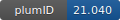

**Project ID:** [plumID:21.040]({{ '/' | absolute_url }}eggs/21/040/)  
**Name:**  A structural ensemble of a tau-microtubule complex reveals regulatory tau phosphorylation and acetylation mechanisms  
**Archive:** [ https://github.com/vendruscolo-lab/tau-microtubules/raw/main/tau-microtubulesInput.zip](https://github.com/vendruscolo-lab/tau-microtubules/raw/main/tau-microtubulesInput.zip)  
**Category:**  bio  
**Keywords:**  EMMI, CryoEM, tau-microtubules, post-translational modifications, chemical mutagenesis, structural ensemble, Metainference  
**PLUMED version:**  2.6  
**Contributor:**  Faidon Brotzakis  
**Submitted on:** 16 Sep 2021  
**Publication:** [Z. F. Brotzakis, P. R. Lindstedt, R. J. Taylor, D. J. Rinauro, N. C. T. Gallagher, G. J. L. Bernardes, M. Vendruscolo, A Structural Ensemble of a Tau-Microtubule Complex Reveals Regulatory Tau Phosphorylation and Acetylation Mechanisms. ACS Central Science. 7, 1986–1995 (2021)](http://dx.doi.org/10.1021/acscentsci.1c00585)  
  
**PLUMED input files**  
  
| File     | Compatible with |  
|:--------:|:--------:|  
| [PRODUCTION/plumed.dat](./data/PRODUCTION/plumed.dat.md) |    |  
  
**Last tested:**  19 Feb 2025, 14:27:36
  
**Project description and instructions**  
The deposited input files contain the following directories. 1) The “TOPO_MDP” directory containing the GROMACS topology and parameter files. 2) The “PRODUCTION” directory containing the plumed input file for EMMI and the associated companion files such as an index file, data GMM file (MT_TAU.dat) More information can be found [here](https://github.com/vendruscolo-lab/tau-microtubules). GROMACS 2018.6 double precision patched with PLUMED 2.6.0-dev was used. 

  
**Submission history**  
**[v1]** 16 Sep 2021: original submission  
  
**Badge**  
Click on the image below and get the code to add the badge to your website!  

  

    &times;
    Markdown<pre></pre>
    HTML<pre>&lt;a href="https://www.plumed-nest.org/eggs/21/040/"&gt;&lt;img src="https://www.plumed-nest.org/eggs/21/040/badge.svg" alt="plumID:21.040"&gt;&lt;/a&gt;</pre>
  

