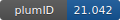

**Project ID:** [plumID:21.042]({{ '/' | absolute_url }}eggs/21/042/)  
**Name:**  Peptoid-mediated Au nanocrystal growth  
**Archive:** [ https://github.com/xinqiz/peptoid_au/raw/main/Peptoid_Au.zip](https://github.com/xinqiz/peptoid_au/raw/main/Peptoid_Au.zip)  
**Category:**  materials  
**Keywords:**  parallel-bias metadynamics, peptoid, Au  
**PLUMED version:**  2.4  
**Contributor:**  Xin Qi  
**Submitted on:** 20 Oct 2021  
**Publication:** [B. Jin, F. Yan, X. Qi, B. Cai, J. Tao, X. Fu, S. Tan, P. Zhang, J. Pfaendtner, N. Y. Naser, F. Baneyx, X. Zhang, J. J. DeYoreo, C. Chen, Peptoid‐Directed Formation of Five‐Fold Twinned Au Nanostars through Particle Attachment and Facet Stabilization. Angewandte Chemie. 134 (2022)](http://dx.doi.org/10.1002/ange.202201980)  
  
**PLUMED input files**  
  
| File     | Compatible with |  
|:--------:|:--------:|  
| [Plumed_nest/plumed_Nce3Ncp6_Au100.dat](./data/Plumed_nest/plumed_Nce3Ncp6_Au100.dat.md) |    |  
| [Plumed_nest/plumed_Nce3Ncp6_Au111.dat](./data/Plumed_nest/plumed_Nce3Ncp6_Au111.dat.md) |    |  
| [Plumed_nest/plumed_Nce6Ncp6_Au100.dat](./data/Plumed_nest/plumed_Nce6Ncp6_Au100.dat.md) |    |  
| [Plumed_nest/plumed_Nce6Ncp6_Au111.dat](./data/Plumed_nest/plumed_Nce6Ncp6_Au111.dat.md) |    |  
  
**Last tested:**  19 Feb 2025, 14:28:07
  
**Project description and instructions**  
These files can be used with GROMACS 5.1 and PLUMED 2.4 to reproduce the results.

  
**Submission history**  
**[v1]** 20 Oct 2021: original submission  
  
**Badge**  
Click on the image below and get the code to add the badge to your website!  

  

    &times;
    Markdown<pre></pre>
    HTML<pre>&lt;a href="https://www.plumed-nest.org/eggs/21/042/"&gt;&lt;img src="https://www.plumed-nest.org/eggs/21/042/badge.svg" alt="plumID:21.042"&gt;&lt;/a&gt;</pre>
  

