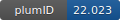

**Project ID:** [plumID:22.023]({{ '/' | absolute_url }}eggs/22/023/)  
**Name:**  Determination of the structure and dynamics of the fuzzy coat of an amyloid fibril of IAPP using cryo-electron microscopy  
**Archive:** [ https://github.com/vendruscolo-lab/IAPP/raw/main/IAPPInput.zip](https://github.com/vendruscolo-lab/IAPP/raw/main/IAPPInput.zip)  
**Category:**  bio  
**Keywords:**  CryoEM, MEMMI,EMMI, Metadynamics, Metainference, IAPP, structural ensemble  
**PLUMED version:**  2.6-mod  
**Contributor:**  Faidon Brotzakis  
**Submitted on:** 04 May 2022  
**Publication:** [Z. Faidon Brotzakis, T. Löhr, S. Truong, S. Hoff, M. Bonomi, M. Vendruscolo, Determination of the Structure and Dynamics of the Fuzzy Coat of an Amyloid Fibril of IAPP Using Cryo-Electron Microscopy. Biochemistry. 62, 2407–2416 (2023)](http://dx.doi.org/10.1021/acs.biochem.3c00010)  
  
**PLUMED input files**  
  
| File     | Compatible with |  
|:--------:|:--------:|  
| [ANALYSIS/plumed_analysis.dat](./data/ANALYSIS/plumed_analysis.dat.md) |     |  
| [ANALYSIS/plumed_analysis_unbiased.dat](./data/ANALYSIS/plumed_analysis_unbiased.dat.md) |     |  
| [PRODUCTION/plumed.dat](./data/PRODUCTION/plumed.dat.md) |     |  
  
**Last tested:**  19 Feb 2025, 14:41:27
  
**Project description and instructions**  
The TOPO_MDP folder containts GROMACS topology and parameter files. PRODUCTION contains the PLUMED file and the associated companion files such as an index file, data GMM file (iapp.dat), structure.pdb file and job submission file used.  ANALYSIS folder contains the plumed_analysis.dat file used to print the CVs of the biased N-tail side as well as the final torrie-value weight per-frame. plumed_analysis_unbiased.dat is used to print the unbiased N-tail side CVs. The MEMMI method is implemented in the `emmi-bias-sigmasem` branch of the plumed master branch accessible [here](https://github.com/tlhr/plumed2.git). More information can be found in [here](https://github.com/vendruscolo-lab/IAPP). 

  
**Submission history**  
**[v1]** 04 May 2022: original submission  
  
**Badge**  
Click on the image below and get the code to add the badge to your website!  

  

    &times;
    Markdown<pre></pre>
    HTML<pre>&lt;a href="https://www.plumed-nest.org/eggs/22/023/"&gt;&lt;img src="https://www.plumed-nest.org/eggs/22/023/badge.svg" alt="plumID:22.023"&gt;&lt;/a&gt;</pre>
  

