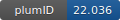

**Project ID:** [plumID:22.036]({{ '/' | absolute_url }}eggs/22/036/)  
**Name:**  Well-tempered MetaDynamics with Hamiltonian Replica Exchange on Holliday Junction  
**Archive:** [ https://github.com/MoiCatPigeon/WT-MetaD-HREX_HJ/archive/refs/heads/main.zip](https://github.com/MoiCatPigeon/WT-MetaD-HREX_HJ/archive/refs/heads/main.zip)  
**Category:**  bio  
**Keywords:**  Well-tempered MetaDynamics with Hamiltonian Replica Exchange  
**PLUMED version:**  2.5.6  
**Contributor:**  Miroslav Krepl  
**Submitted on:** 24 Sep 2022  
**Publication:** [Z. Zhang, J. Šponer, G. Bussi, V. Mlýnský, P. Šulc, C. R. Simmons, N. Stephanopoulos, M. Krepl, Atomistic Picture of Opening–Closing Dynamics of DNA Holliday Junction Obtained by Molecular Simulations. Journal of Chemical Information and Modeling. 63, 2794–2809 (2023)](http://dx.doi.org/10.1021/acs.jcim.3c00358)  
  
**PLUMED input files**  
  
| File     | Compatible with |  
|:--------:|:--------:|  
| [plumed.dat](./data/plumed.dat.md) |     |  
  
**Last tested:**  19 Feb 2025, 14:31:05
  
**Project description and instructions**  
Detailed instruction under README.dat file. The topology and coordinate files were prepared in AMBER18, proceeded by ParmED. Then, they were converted to GROMACS format by ParmED. GROMACS-v2018 and PLUMED-v2.5.6 were used for the WT-MetaD-HREX simulations, and the latter was also used for data processing.

  
**Submission history**  
**[v1]** 24 Sep 2022: original submission  
  
**Badge**  
Click on the image below and get the code to add the badge to your website!  

  

    &times;
    Markdown<pre></pre>
    HTML<pre>&lt;a href="https://www.plumed-nest.org/eggs/22/036/"&gt;&lt;img src="https://www.plumed-nest.org/eggs/22/036/badge.svg" alt="plumID:22.036"&gt;&lt;/a&gt;</pre>
  

