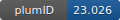

**Project ID:** [plumID:23.026]({{ '/' | absolute_url }}eggs/23/026/)  
**Name:**  Machine Learning Nucleation Collective Variables with Graph Neural Networks  
**Archive:** [ https://github.com/mme-ucl/NNucleate/raw/main/examples/plumed_files.zip](https://github.com/mme-ucl/NNucleate/raw/main/examples/plumed_files.zip)  
**Category:**  chemistry  
**Keywords:**  Nucleation, Machine Learning, Enhanced Sampling, Collective Variables, Graph Neural Networks  
**PLUMED version:**  2.5.2  
**Contributor:**  Florian Dietrich  
**Submitted on:** 29 Jun 2023  
**Publication:** [F. Dietrich, X. Rosas Advincula, G. Gobbo, M. Bellucci, M. Salvalaglio, Machine Learning Nucleation Collective Variables with Graph Neural Networks (2023)](http://dx.doi.org/10.26434/chemrxiv-2023-l6jjd)  
  
**PLUMED input files**  
  
| File     | Compatible with |  
|:--------:|:--------:|  
| [plumed_analytical.dat](./data/plumed_analytical.dat.md) |    |  
| [plumed_model_2D_WTD.dat](./data/plumed_model_2D_WTD.dat.md) |     |  
| [plumed_model_pulling.dat](./data/plumed_model_pulling.dat.md) |     |  
  
**Last tested:**  26 Jan 2024, 15:17:27
  
**Project description and instructions**  
The input file is designed to be executed using the driver to post-process LAMMPS simulations of the colloidal system described in the publication to obtain analytical reference values for the collective variables n and n(Q6). The model.py file contains a fully trained GNN model that can be used as a nucleation CV in this system using the [PyCV](https://giorginolab.github.io/plumed2-pycv/) PLUMED fork. The other PLUMED input demonstrate an example use of the trained CV in a pulling simulation. For code documentation and a tutorial visit [here](https://flofega.github.io/NNucleate/).
  
**Submission history**  
**[v1]** 29 Jun 2023: original submission  
  
**Badge**  
Click on the image below and get the code to add the badge to your website!  

  

    &times;
    Markdown<pre></pre>
    HTML<pre>&lt;a href="https://www.plumed-nest.org/eggs/23/026/"&gt;&lt;img src="https://www.plumed-nest.org/eggs/23/026/badge.svg" alt="plumID:23.026"&gt;&lt;/a&gt;</pre>
  

