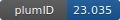

**Project ID:** [plumID:23.035]({{ '/' | absolute_url }}eggs/23/035/)  
**Name:**  An Extended Metadynamics Protocol for Binding/Unbinding of Peptide Ligands to Class A G-Protein Coupled Receptors  
**Archive:** [ https://github.com/jacquecr23/Peptide-ligands-binding-protocol/raw/main/Peptide-ligands-binding-unbinding-protocol.zip](https://github.com/jacquecr23/Peptide-ligands-binding-protocol/raw/main/Peptide-ligands-binding-unbinding-protocol.zip)  
**Category:**  bio  
**Keywords:**  G protein coupled receptor, peptide ligands, metadynamics, multiple-walker  
**PLUMED version:**  2.7.3  
**Contributor:**  Timothy Clark  
**Submitted on:** 30 Aug 2023  
**Publication:** [J. C. Calderón, E. Plut, M. Keller, C. Cabrele, O. Reiser, F. L. Gervasio, T. Clark, Extended Metadynamics Protocol for Binding/Unbinding Free Energies of Peptide Ligands to Class A G-Protein-Coupled Receptors. Journal of Chemical Information and Modeling. 64, 205–218 (2023)](http://dx.doi.org/10.1021/acs.jcim.3c01574)  
  
**PLUMED input files**  
  
| File     | Compatible with |  
|:--------:|:--------:|  
| [Y4R_SRS_Gi/MW-WT-MetaD_Y4R-SRS-Gi/plumed.dat](./data/Y4R_SRS_Gi/MW-WT-MetaD_Y4R-SRS-Gi/plumed.dat.md) |    |  
  
**Last tested:**  19 Feb 2025, 14:22:44
  
**Project description and instructions**  
Multiple-walker metadynamics simulations were performed using GROMACS 2021.4 with the PLUMED 2.7.3 plug-in. Topologies for the receptor, peptides, and G protein were generated using the AMBER99SB-ILDN force field.
  
**Submission history**  
**[v1]** 30 Aug 2023: original submission  
  
**Badge**  
Click on the image below and get the code to add the badge to your website!  

  

    &times;
    Markdown<pre></pre>
    HTML<pre>&lt;a href="https://www.plumed-nest.org/eggs/23/035/"&gt;&lt;img src="https://www.plumed-nest.org/eggs/23/035/badge.svg" alt="plumID:23.035"&gt;&lt;/a&gt;</pre>
  

