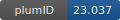

**Project ID:** [plumID:23.037]({{ '/' | absolute_url }}eggs/23/037/)  
**Name:**  Estimating binding free energy of solid binding peptides without extensive sampling  
**Archive:** [ https://github.com/xinqi23/SBP2023/raw/main/SBP_plumed_nest.zip](https://github.com/xinqi23/SBP2023/raw/main/SBP_plumed_nest.zip)  
**Category:**  bio  
**Keywords:**  metadynamics, solid binding peptides  
**PLUMED version:**  2.6  
**Contributor:**  Xin Qi  
**Submitted on:** 14 Sep 2023  
**Publication:** unpublished  
  
**PLUMED input files**  
  
| File     | Compatible with |  
|:--------:|:--------:|  
| [SBP_plumed_nest/Plumed_files/GGTGG/plumed.dat](./data/SBP_plumed_nest/Plumed_files/GGTGG/plumed.dat.md) |    |  
| [SBP_plumed_nest/Plumed_files/K8AK11A/plumed.dat](./data/SBP_plumed_nest/Plumed_files/K8AK11A/plumed.dat.md) |    |  
  
**Last tested:**  26 Jan 2024, 15:17:15
  
**Project description and instructions**  
Initial configurations, run files for GROMACS and two complete examples of metadynamics are included.
  
**Submission history**  
**[v1]** 14 Sep 2023: original submission  
  
**Badge**  
Click on the image below and get the code to add the badge to your website!  

  

    &times;
    Markdown<pre></pre>
    HTML<pre>&lt;a href="https://www.plumed-nest.org/eggs/23/037/"&gt;&lt;img src="https://www.plumed-nest.org/eggs/23/037/badge.svg" alt="plumID:23.037"&gt;&lt;/a&gt;</pre>
  

