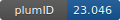

**Project ID:** [plumID:23.046]({{ '/' | absolute_url }}eggs/23/046/)  
**Name:**  Lasso Peptides - HLDA CV  
**Archive:** [ https://github.com/gabedahora/HLDA-WTMetaD-lasso/raw/main/lasso_HLDA.zip](https://github.com/gabedahora/HLDA-WTMetaD-lasso/raw/main/lasso_HLDA.zip)  
**Category:**  bio  
**Keywords:**  metadynamics, protein folding, HLDA, harmonic  
**PLUMED version:**  2.7.1  
**Contributor:**  Gabriel da Hora  
**Submitted on:** 21 Dec 2023  
**Publication:** unpublished  
  
**PLUMED input files**  
  
| File     | Compatible with |  
|:--------:|:--------:|  
| [github/MccJ25/plumed.dat](./data/github/MccJ25/plumed.dat.md) |    |  
| [github/Sun/plumed.dat](./data/github/Sun/plumed.dat.md) |    |  
| [github/Uln/plumed.dat](./data/github/Uln/plumed.dat.md) |    |  
  
**Last tested:**  26 Jan 2024, 15:17:21
  
**Project description and instructions**  
These are AMBER and PLUMED files to run Well-Tempered Metadynamics for each lasso peptide (MccJ25, ulleungdin and sungsanpin) with two CVs. One of the CVs biases the isopeptide bond between residues 1 and 8 and the second is defined by HLDA as a combination of weighted distances from the ring 1-8 to the piercing residue.
  
**Submission history**  
**[v1]** 21 Dec 2023: original submission  
  
**Badge**  
Click on the image below and get the code to add the badge to your website!  

  

    &times;
    Markdown<pre></pre>
    HTML<pre>&lt;a href="https://www.plumed-nest.org/eggs/23/046/"&gt;&lt;img src="https://www.plumed-nest.org/eggs/23/046/badge.svg" alt="plumID:23.046"&gt;&lt;/a&gt;</pre>
  

