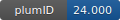

**Project ID:** [plumID:24.000]({{ '/' | absolute_url }}eggs/24/000/)  
**Name:**  Ammonia Decomposition on Non-stoichiometric Lithium Imide  
**Archive:** [ https://github.com/francescomambretti/Li2NH-LiNH2_mix/archive/refs/heads/main.zip](https://github.com/francescomambretti/Li2NH-LiNH2_mix/archive/refs/heads/main.zip)  
**Category:**  chemistry  
**Keywords:**  ammonia decomposition, non-stoichiometric lithium imide, machine learning interatomic potentials, enhanced sampling, heterogeneous catalysis  
**PLUMED version:**  2.8.1  
**Contributor:**  Francesco Mambretti  
**Submitted on:** 12 Jan 2024  
**Publication:** [F. Mambretti, U. Raucci, M. Yang, M. Parrinello, How Does Structural Disorder Impact Heterogeneous Catalysts? The Case of Ammonia Decomposition on Non-stoichiometric Lithium Imide. ACS Catalysis. 14, 1252–1256 (2024)](http://dx.doi.org/10.1021/acscatal.3c05376)  
  
**PLUMED input files**  
  
| File     | Compatible with |  
|:--------:|:--------:|  
| [scripts/LAMMPS/plumed_LAMMPS/plumed.dat](./data/scripts/LAMMPS/plumed_LAMMPS/plumed.dat.md) |    |  
| [scripts/LAMMPS/plumed_LAMMPS/plumed.driver.dat](./data/scripts/LAMMPS/plumed_LAMMPS/plumed.driver.dat.md) |    |  
  
**Last tested:**  19 Feb 2025, 14:22:27
  
**Project description and instructions**  
Originally used with GROMACS version 2016.3. Software used is ASE, Ovito (Python), LAMMPS, Plumed, DeepMD-Kit, Quantum Espresso. Detailed Instructions are in the [GitHub](https://github.com/francescomambretti/Li2NH-LiNH2_mix) page.

  
**Submission history**  
**[v1]** 12 Jan 2024: original submission  
  
**Badge**  
Click on the image below and get the code to add the badge to your website!  

  

    &times;
    Markdown<pre></pre>
    HTML<pre>&lt;a href="https://www.plumed-nest.org/eggs/24/000/"&gt;&lt;img src="https://www.plumed-nest.org/eggs/24/000/badge.svg" alt="plumID:24.000"&gt;&lt;/a&gt;</pre>
  

