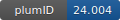

**Project ID:** [plumID:24.004]({{ '/' | absolute_url }}eggs/24/004/)  
**Name:**  Enhanced sampling of Crystal Nucleation with Graph Representation Learnt Variables  
**Archive:** [ https://github.com/connorzzou/PLUMED-NEST/raw/main/GNN-PLUMED-Nucleation-main.zip](https://github.com/connorzzou/PLUMED-NEST/raw/main/GNN-PLUMED-Nucleation-main.zip)  
**Category:**  materials  
**Keywords:**  metadynamics, nucleation, machine learning  
**PLUMED version:**  2.8.1  
**Contributor:**  Ziyue Zou  
**Submitted on:** 16 Feb 2024  
**Publication:** [Z. Zou, P. Tiwary, Enhanced Sampling of Crystal Nucleation with Graph Representation Learnt Variables. The Journal of Physical Chemistry B. 128, 3037–3045 (2024)](http://dx.doi.org/10.1021/acs.jpcb.4c00080)  
  
**PLUMED input files**  
  
| File     | Compatible with |  
|:--------:|:--------:|  
| [glycine/plumed.start.dat](./data/glycine/plumed.start.dat.md) |     |  
| [glycine/post-process/plumed.dat](./data/glycine/post-process/plumed.dat.md) |     |  
| [iron/plumed.dat](./data/iron/plumed.dat.md) |     |  
| [iron/plumed.start.dat](./data/iron/plumed.start.dat.md) |     |  
| [iron/post-process/plumed.dat](./data/iron/post-process/plumed.dat.md) |     |  
  
**Last tested:**  19 Feb 2025, 14:23:24
  
**Project description and instructions**  
LAMMPS version 23Jun2022. Gromacs version 2021.6. PLUMED version 2.8.1. Libtorch plugin required. 

  
**Submission history**  
**[v1]** 16 Feb 2024: original submission  
  
**Badge**  
Click on the image below and get the code to add the badge to your website!  

  

    &times;
    Markdown<pre></pre>
    HTML<pre>&lt;a href="https://www.plumed-nest.org/eggs/24/004/"&gt;&lt;img src="https://www.plumed-nest.org/eggs/24/004/badge.svg" alt="plumID:24.004"&gt;&lt;/a&gt;</pre>
  

