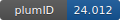

**Project ID:** [plumID:24.012]({{ '/' | absolute_url }}eggs/24/012/)  
**Name:**  Molecular simulations to investigate the impact of N6-methylation in RNA recognition  
**Archive:** [ https://github.com/bussilab/m6a-charge-fitting/archive/master.zip](https://github.com/bussilab/m6a-charge-fitting/archive/master.zip) [(browse)](https://github.com/bussilab/m6a-charge-fitting/tree/master)  
**Category:**  bio  
**Keywords:**  metadynamics, alchemistry, RNA modification, RNA:protein interactions  
**PLUMED version:**  2.9  
**Contributor:**  Giovanni Bussi  
**Submitted on:** 21 May 2024  
**Publication:** [V. Piomponi, Miroslav Krepl, Jiri Sponer, and Giovanni Bussi. Molecular simulations to investigate the impact of N6-methylation in RNA recognition: Improving accuracy and precision of binding free energy prediction](https://arxiv.org/abs/2404.14821)  
  
**PLUMED input files**  
  
| File     | Compatible with |  
|:--------:|:--------:|  
| [AFEC_YTH_example/plumed.dat](./data/AFEC_YTH_example/plumed.dat.md) |    |  
  
**Last tested:**  19 Feb 2025, 14:22:53
  
**Project description and instructions**  
Input file for metadynamics simulation is located in directory `AFEC_YTH_example/plumed.dat`.

  
**Submission history**  
**[v1]** 21 May 2024: original submission  
  
**Badge**  
Click on the image below and get the code to add the badge to your website!  

  

    &times;
    Markdown<pre></pre>
    HTML<pre>&lt;a href="https://www.plumed-nest.org/eggs/24/012/"&gt;&lt;img src="https://www.plumed-nest.org/eggs/24/012/badge.svg" alt="plumID:24.012"&gt;&lt;/a&gt;</pre>
  

