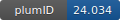

**Project ID:** [plumID:24.034]({{ '/' | absolute_url }}eggs/24/034/)  
**Name:**  Umbrella sampling of ion in transporter SLC26A7  
**Archive:** [ https://github.com/Xiaoli-Lu/US_SLC26A7/raw/main/plumed-nest-data.zip](https://github.com/Xiaoli-Lu/US_SLC26A7/raw/main/plumed-nest-data.zip)  
**Category:**  bio  
**Keywords:**  umbrella sampling, transporter, ions  
**PLUMED version:**  2.6  
**Contributor:**  Xiaoli Lu  
**Submitted on:** 09 Dec 2024  
**Publication:** unpublished  
  
**PLUMED input files**  
  
| File     | Compatible with |  
|:--------:|:--------:|  
| [plumed_us_run.dat](./data/plumed_us_run.dat.md) |    |  
  
**Last tested:**  19 Feb 2025, 14:20:38
  
**Project description and instructions**  
We recommend to perform the MD simulation using Openmm7 with PLUMED 2.6.

  
**Submission history**  
**[v1]** 09 Dec 2024: original submission  
  
**Badge**  
Click on the image below and get the code to add the badge to your website!  

  

    &times;
    Markdown<pre></pre>
    HTML<pre>&lt;a href="https://www.plumed-nest.org/eggs/24/034/"&gt;&lt;img src="https://www.plumed-nest.org/eggs/24/034/badge.svg" alt="plumID:24.034"&gt;&lt;/a&gt;</pre>
  

