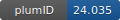

**Project ID:** [plumID:24.035]({{ '/' | absolute_url }}eggs/24/035/)  
**Name:**  Data efficient machine learning potentials for modeling catalytic reactivity via active learning and enhanced sampling  
**Archive:** [ https://github.com/luigibonati/DEAL/archive/main.zip](https://github.com/luigibonati/DEAL/archive/main.zip) [(browse)](https://github.com/luigibonati/DEAL/tree/main)  
**Category:**  chemistry  
**Keywords:**  opes, catalysis, ammonia, machine learning potentials  
**PLUMED version:**  2.9  
**Contributor:**  Luigi Bonati  
**Submitted on:** 13 Dec 2024  
**Publication:** [S. Perego, L. Bonati, Data efficient machine learning potentials for modeling catalytic reactivity via active learning and enhanced sampling. npj Computational Materials. 10 (2024)](http://dx.doi.org/10.1038/s41524-024-01481-6)  
  
**PLUMED input files**  
  
| File     | Compatible with |  
|:--------:|:--------:|  
| [.../1_exploration/N2_flooding_inputs/plumed-fresh.dat](./data/notebooks/1_exploration/N2_flooding_inputs/plumed-fresh.dat.md) |    |  
| [..._exploration/N2_flooding_inputs/plumed-restart.dat](./data/notebooks/1_exploration/N2_flooding_inputs/plumed-restart.dat.md) |    |  
| [notebooks/2_convergence/N2_opes_inputs/plumed.dat](./data/notebooks/2_convergence/N2_opes_inputs/plumed.dat.md) |    |  
  
**Last tested:**  19 Feb 2025, 14:19:28
  
**Project description and instructions**  
See software and instructions to generate the input files [here](https://github.com/luigibonati/DEAL).

  
**Submission history**  
**[v1]** 13 Dec 2024: original submission  
  
**Badge**  
Click on the image below and get the code to add the badge to your website!  

  

    &times;
    Markdown<pre></pre>
    HTML<pre>&lt;a href="https://www.plumed-nest.org/eggs/24/035/"&gt;&lt;img src="https://www.plumed-nest.org/eggs/24/035/badge.svg" alt="plumID:24.035"&gt;&lt;/a&gt;</pre>
  

