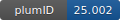

**Project ID:** [plumID:25.002]({{ '/' | absolute_url }}eggs/25/002/)  
**Name:**  M3_PCV-ABMD  
**Archive:** [ https://github.com/gmelisi/M3_PCV-ABMD/raw/main/M3_PCV_ABMD.zip](https://github.com/gmelisi/M3_PCV-ABMD/raw/main/M3_PCV_ABMD.zip)  
**Category:**  chemistry  
**Keywords:**  Adiabatic bias MD, path CVs, ligand unbinding, G protein coupled receptor  
**PLUMED version:**  2.8  
**Contributor:**  Gian Marco Elisi  
**Submitted on:** 16 Jan 2025  
**Publication:** unpublished  
  
**PLUMED input files**  
  
| File     | Compatible with |  
|:--------:|:--------:|  
| [M2R/plumed.dat](./data/M2R/plumed.dat.md) |    |  
| [M3R/plumed.dat](./data/M3R/plumed.dat.md) |    |  
  
**Last tested:**  19 Feb 2025, 14:25:58
  
**Project description and instructions**  
Input files to carry out adiabatic bias MD simulations of the tiotropium unbinding from M3 and M2 receptors using path CVs. The zip includes Amber structure (inpcrd) and topology (prmtop) files to use as initial configurations to launch the simulations, the plumed input file plumed.dat necessary to perform adiabatic bias MD with path CVs, and an Amber input files with MD settings (pcv-abmd.in). The REPARAM.pdb file is the guess path necessary to use the path CVs. Moreover, an additional script reports the command to launch simulations.

  
**Submission history**  
**[v1]** 16 Jan 2025: original submission  
  
**Badge**  
Click on the image below and get the code to add the badge to your website!  

  

    &times;
    Markdown<pre></pre>
    HTML<pre>&lt;a href="https://www.plumed-nest.org/eggs/25/002/"&gt;&lt;img src="https://www.plumed-nest.org/eggs/25/002/badge.svg" alt="plumID:25.002"&gt;&lt;/a&gt;</pre>
  

