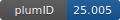

**Project ID:** [plumID:25.005]({{ '/' | absolute_url }}eggs/25/005/)  
**Name:**  Mechanism of Nanocluster Formation from Machine-Learned Potential-based Simulations  
**Archive:** [ https://github.com/vikast282/Ag6L6_nucleation/archive/main.zip](https://github.com/vikast282/Ag6L6_nucleation/archive/main.zip) [(browse)](https://github.com/vikast282/Ag6L6_nucleation/tree/main)  
**Category:**  chemistry  
**Keywords:**  WT-metadynamics, metal nanoclusters, nucleation, neural network potential, deepMD  
**PLUMED version:**  2.8.2  
**Contributor:**  Vikas Tiwari, Tarak Karmakar  
**Submitted on:** 02 Feb 2025  
**Publication:** [V. Tiwari, Dr. T. Karmakar, Understanding the Mechanism of Nanocluster Formation from Machine-Learned Potential-based Simulations (2025)](http://dx.doi.org/10.26434/chemrxiv-2025-rkv0g)  
  
**PLUMED input files**  
  
| File     | Compatible with |  
|:--------:|:--------:|  
| [dimer_octahedral/plumed.dat](./data/dimer_octahedral/plumed.dat.md) |    |  
| [monomer_dimer/plumed.dat](./data/monomer_dimer/plumed.dat.md) |    |  
  
**Last tested:**  19 Feb 2025, 14:53:10
  
**Project description and instructions**  
The inputs files can be used to run the neural network potential based molecular dynamics for metal nanocluster nucleation in LAAMPS integrated with DeepMD-kit 2.2.10 and PLUMED 2.8.2.

  
**Submission history**  
**[v1]** 02 Feb 2025: original submission  
  
**Badge**  
Click on the image below and get the code to add the badge to your website!  

  

    &times;
    Markdown<pre></pre>
    HTML<pre>&lt;a href="https://www.plumed-nest.org/eggs/25/005/"&gt;&lt;img src="https://www.plumed-nest.org/eggs/25/005/badge.svg" alt="plumID:25.005"&gt;&lt;/a&gt;</pre>
  

