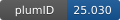

**Project ID:** [plumID:25.030]({{ '/' | absolute_url }}eggs/25/030/)  
**Name:**  Committor Regularization  
**Archive:** [ https://github.com/mme-ucl/NNucleate/raw/main/examples/CR_paper_inputs_all.zip](https://github.com/mme-ucl/NNucleate/raw/main/examples/CR_paper_inputs_all.zip)  
**Category:**  methods  
**Keywords:**  metadynamics, enhanced sampling, mlcvs, committor, machine learning  
**PLUMED version:**  2.5.2  
**Contributor:**  Florian Dietrich  
**Submitted on:** 17 Nov 2025  
**Publication:** [F. Dietrich, M. Bellucci, M. Salvalaglio, Committor-Regularized Learning of Differentiable Collective Variables from Non-Differentiable Structural Descriptors. doi: 10.26434/chemrxiv-2025-8gqqj (2025)](http://dx.doi.org/10.26434/chemrxiv-2025-8gqqj)  
  
**PLUMED input files**  
  
| File     | Compatible with |  
|:--------:|:--------:|  
| [plumed_mtd.dat](./data/plumed_mtd.dat.md) |    |  
| [plumed_pulling.dat](./data/plumed_pulling.dat.md) |    |  
  
**Last tested:**  17 Jun 2026, 09:05:02
  
**Project description and instructions**  
The simulations run with lammps (input file lmp_in) and use the plumed fork PyCV, requiring the PYTHONCV keyword. The GNNs run using a cythonized version of the neighbourlist algorithm implemented in MDTraj which can be compiled using the files provided [here](https://github.com/mme-ucl/NNucleate/tree/main/Cython_Neighbourlist). 

  

<b><a href="https://www.plumed.org/doc-master/user-doc/html/actionlist/?actions=UNITS,METAD,MOVINGRESTRAINT,PRINT" target="_blank">Click here</a> to open manual pages for actions used in this project.</b>

**Submission history**  
**[v1]** 17 Nov 2025: original submission  
  
**Badge**  
Click on the image below and get the code to add the badge to your website!  

  

    &times;
    Markdown<pre></pre>
    HTML<pre>&lt;a href="https://www.plumed-nest.org/eggs/25/030/"&gt;&lt;img src="https://www.plumed-nest.org/eggs/25/030/badge.svg" alt="plumID:25.030"&gt;&lt;/a&gt;</pre>
  

